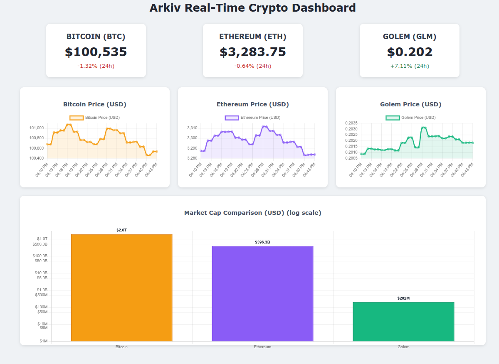

Welcome to this step-by-step guide on building a full-stack, real-time cryptocurrency dashboard using Arkiv as a decentralized data layer.

## The Goal

The goal of this tutorial is to demonstrate how to use Arkiv for a common real-world use case: periodically storing time-sensitive data on the blockchain and then reading that data to power a live frontend application.

We will build a complete application consisting of two main parts:

1. **A Node.js Backend Service:** This script will run continuously, fetching the latest market data for Bitcoin (BTC), Ethereum (ETH), and Golem (GLM) from the CoinGecko API every 60 seconds. It will then use the Arkiv SDK to store this data on the Kaolin testnet.

2. **A Frontend Dashboard:** A simple HTML, CSS, and JavaScript application that queries the Arkiv blockchain to get the data published by our backend. It will then visualize this data in a clean, user-friendly dashboard using the Chart.js library.

### The Final Product

By the end of this tutorial, you will have a dashboard that displays:

- The latest prices of BTC, ETH, and GLM
- Price changes over time, updated every minute
- Overview of the market capitalization for each cryptocurrency

Check out a live demo of the final application [here](https://arkiv-network.github.io/learn-arkiv/_demos/fullstack-tutorial/).

This guide is designed to be a hands-on learning experience. We'll break down each step, explain the code, and show you how to connect all the pieces. Let's get started!
